<div align="center">

# 🚀 Kubernetes Microservices with GitOps  
### 🌩️ End-to-End DevOps Implementation on AWS EKS

<p align="center">
  
  
  
  
  
  
  
</p>

</div>

---

## 📌 Project Overview

This project demonstrates a **production-ready DevOps pipeline** implementing:

- 🔁 CI/CD with Jenkins  
- 🐳 Docker containerization  
- ☸️ Kubernetes orchestration on AWS EKS  
- 🔄 GitOps deployment using ArgoCD  
- 📊 Monitoring with Prometheus & Grafana  
- 🌐 Path-based routing using NGINX Ingress  

The system follows **GitOps principles**, ensuring automated, scalable, and self-healing deployments.

---

## 🏗️ Architecture Diagram

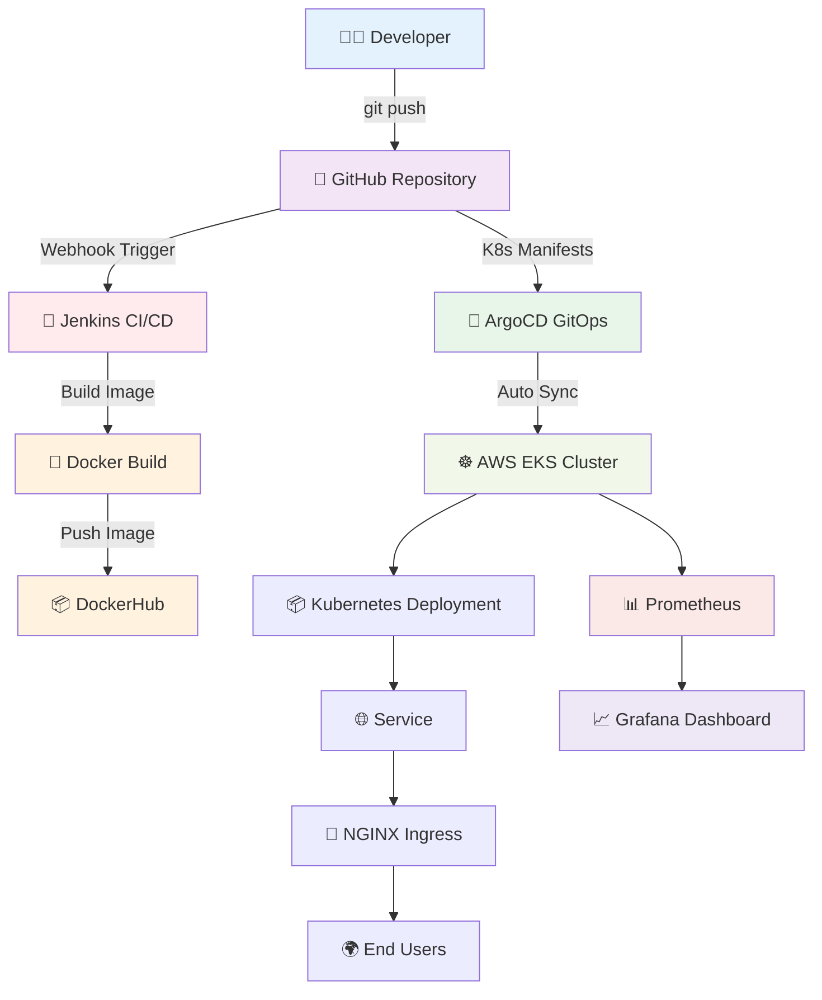

### ☸️ AWS EKS Cluster Overview

<div align="center">
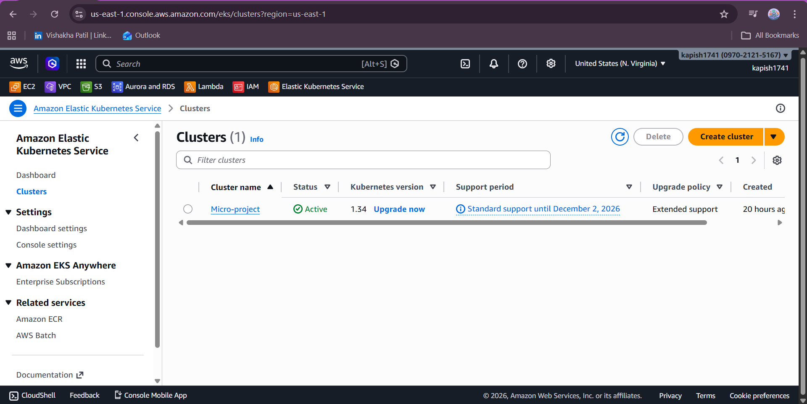
</div>

📌 Shows:
- Worker nodes
- Node group status
- Cluster health
- Running workloads

---

## 🛠️ Tech Stack

| Category | Tools Used |
|----------|------------|
| ☁️ Cloud | AWS EC2, AWS EKS |
| 🔁 CI/CD | Jenkins |
| 🐳 Containerization | Docker, DockerHub |
| ☸️ Orchestration | Kubernetes |
| 🔄 GitOps | ArgoCD |
| 📦 Package Manager | Helm |
| 📊 Monitoring | Prometheus, Node Exporter |
| 📈 Visualization | Grafana |
| 🌐 Networking | NGINX Ingress Controller |

---

## ☁️ AWS Infrastructure Setup

### 🖥️ EC2 Instance Dashboard

<div align="center">
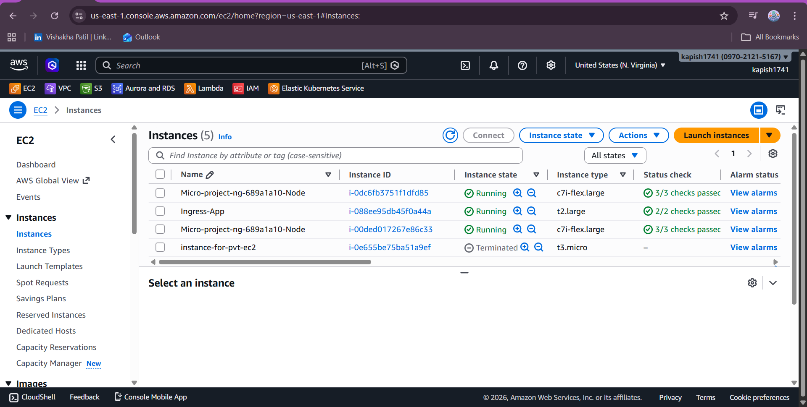
</div>

📌 EC2 Configuration:
- Ubuntu Server
- Jenkins Installed
- Docker Installed
- kubectl & eksctl configured
- Connected to AWS EKS cluster

---

## 🔁 CI/CD Workflow

### 1️⃣ Code Commit
- Developer pushes code to GitHub
  
---

### 2️⃣ Jenkins Pipeline Execution
<div align="center">
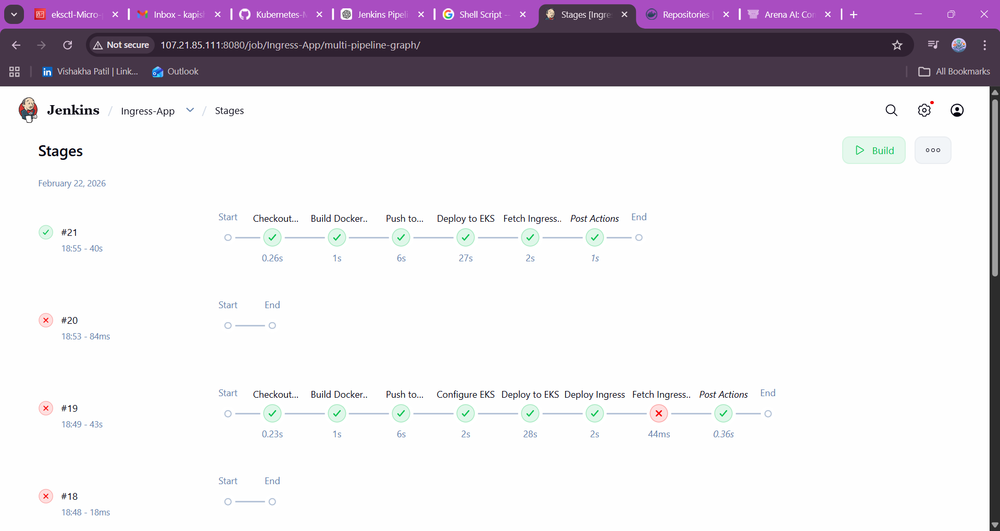
</div>

📌 Pipeline Stages:
- Source Code Checkout  
- Docker Image Build  
- Docker Image Push to DockerHub  
- Kubernetes Manifest Update  
- Deployment to AWS EKS  

---
---

### 🐳 DockerHub Repository

<div align="center">
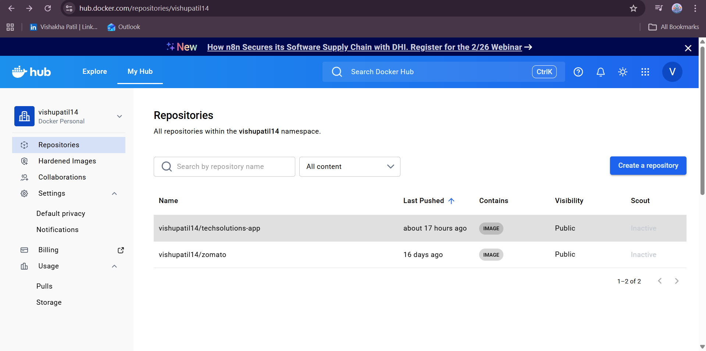
</div>

📌 Displays:
- Versioned Docker images
- Immutable tagging strategy
- Image push from Jenkins pipeline

---

### 3️⃣ GitOps Deployment
- ArgoCD monitors repository
- Auto-syncs changes to cluster
- Maintains desired state

### 4️⃣ Monitoring
- Prometheus scrapes metrics
- Grafana visualizes dashboards
- Alerts configured for failures

---

## 🌐 Application Access

### 📸 Live Application Preview

<div align="center">

### 🏠 Home Page
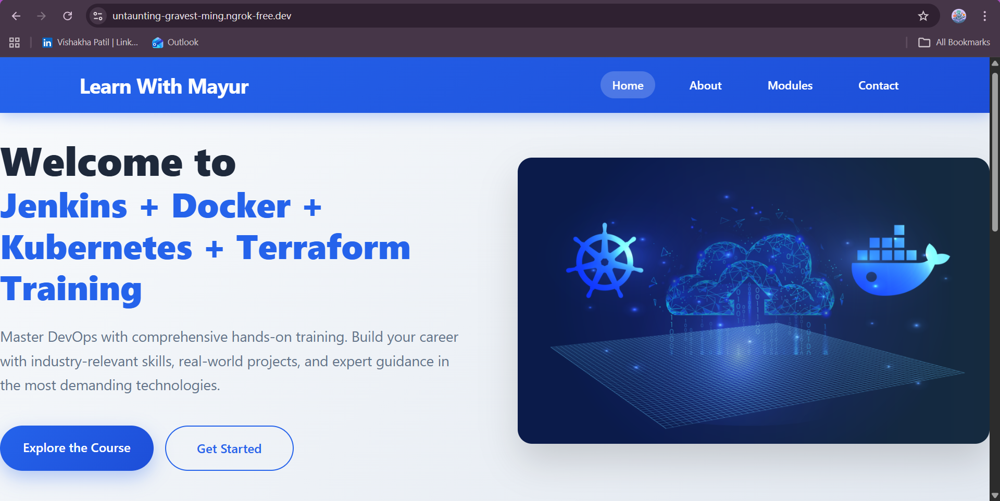

### ℹ️ About Page
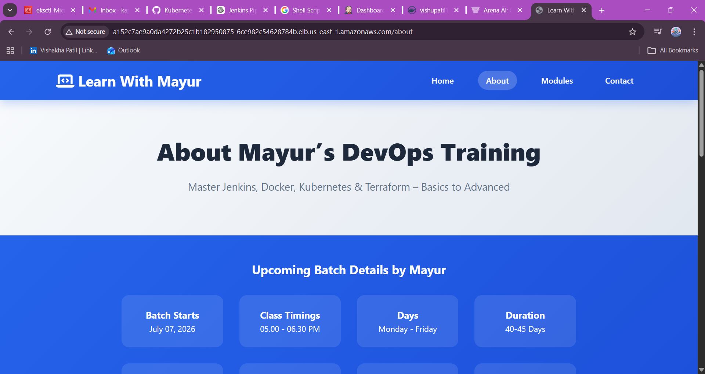

### 🛠️ Services Page
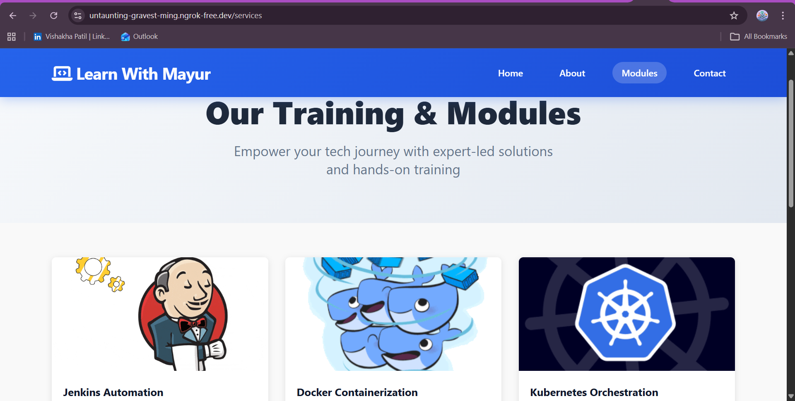

### 📞 Contact Page
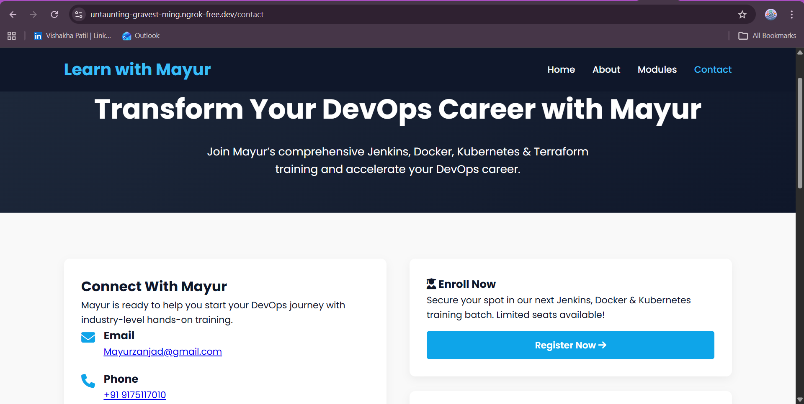

</div>


To retrieve LoadBalancer:

```bash
kubectl get svc -n ingress-nginx
```

---

## 📊 Monitoring & GitOps Dashboards

### 🔥 Prometheus Dashboard

<div align="center">
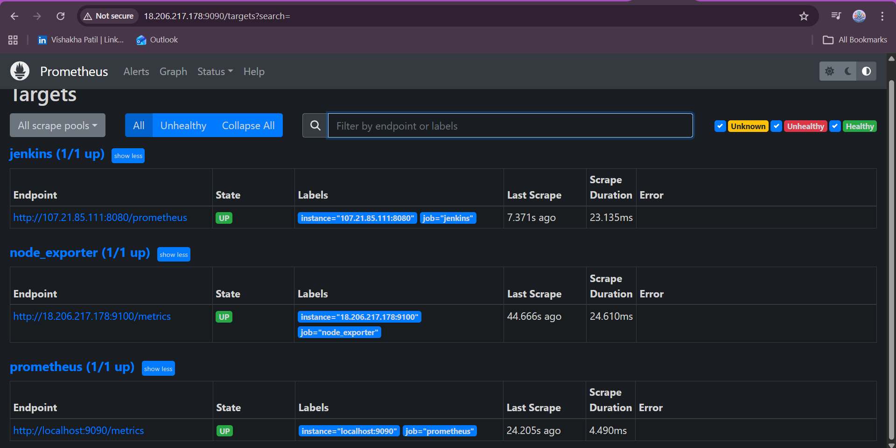
</div>

📌 Displays:
- Kubernetes pod metrics  
- CPU & Memory usage  
- Target health status  
- Node metrics  

---

### 📈 Grafana Dashboard

<div align="center">
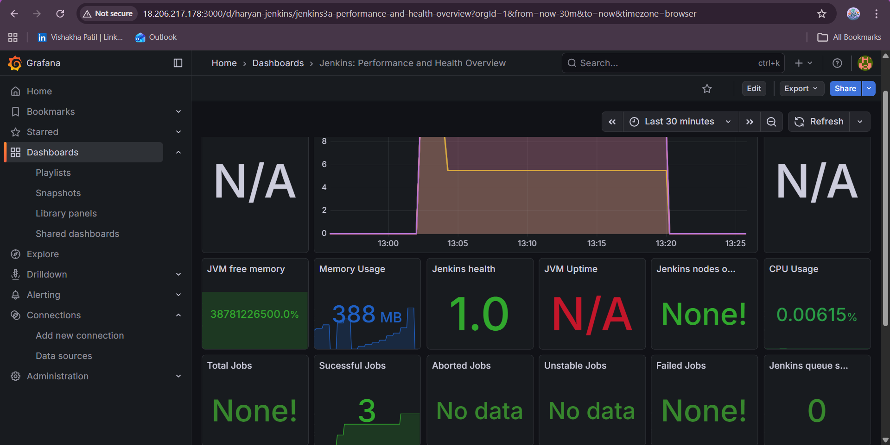
</div>

📌 Shows:
- Cluster resource utilization  
- Node Exporter metrics  
- Application performance graphs  
- Real-time monitoring visualization  

---

### 🔄 ArgoCD Dashboard

<div align="center">

</div>

📌 Provides:
- Application sync status  
- Health status (Healthy / Degraded)  
- Auto-sync configuration  
- GitOps deployment tracking  

---

## 🔄 GitOps Implementation

- ArgoCD installed via Helm
- Auto-sync enabled
- Self-healing deployments
- Rollback capability
- Declarative infrastructure

---

## 🎯 Key Features

✅ Automated CI/CD Pipeline  
✅ Immutable Docker Image Tagging  
✅ Kubernetes Rolling Updates  
✅ Path-Based Routing  
✅ Horizontal Pod Autoscaling  
✅ Cluster Autoscaler  
✅ Production Monitoring  
✅ GitOps Workflow  
✅ Self-Healing Deployments  

---

## 📖 Getting Started

### Clone Repository

```bash
git clone https://github.com/VishakhaPatil-03/Kubernetes-Microservices-with-GitOps.git
cd Kubernetes-Microservices-with-GitOps
```

### Deploy via ArgoCD

```bash
kubectl apply -f argocd/application.yaml
```

---

## 🔐 Network & Security Group Configuration

To ensure proper communication between services, the following ports were configured in the AWS Security Group attached to the EC2/EKS instances.

### 📍 How to Configure Security Group

1. Go to AWS Console  
2. Navigate to **EC2 → Instances**  
3. Select your instance  
4. Click **Security** tab  
5. Click on the attached **Security Group**  
6. Edit **Inbound Rules**  
7. Add the required ports listed below  

---

## 🌐 Required Inbound Ports

| Port | Protocol | Purpose |
|------|----------|----------|
| 22 | TCP | SSH Access |
| 80 | TCP | HTTP Web Application |
| 443 | TCP | HTTPS Secure Access |
| 8080 | TCP | Jenkins Server |
| 6443 | TCP | Kubernetes API Server |
| 9090 | TCP | Prometheus Dashboard |
| 9100 | TCP | Node Exporter Metrics |
| 30000-32767 | TCP | Kubernetes NodePort Services |
| 1000-10000 | TCP | Custom Application Ports |
| 25 | TCP | SMTP (Email Sending) |
| 465 | TCP | SMTPS (Secure Email) |

---

## 🧠 Port Explanation

- **80 / 443** → Application access via Ingress  
- **8080** → Jenkins UI  
- **6443** → Kubernetes API communication  
- **30000–32767** → Kubernetes NodePort range  
- **9090** → Prometheus monitoring  
- **9100** → Node Exporter metrics collection  
- **SMTP / SMTPS** → Email notifications from Jenkins or Alertmanager  

---

⚠️ **Important Security Note**

For production environments:
- Restrict SSH (22) to your IP only  
- Avoid opening wide port ranges to `0.0.0.0/0`  
- Use IAM Roles and private networking where possible  
- Prefer Load Balancer instead of exposing NodePort publicly  

---

## 🎯 Interview Highlights

This project demonstrates:

- End-to-End DevOps Automation
- Kubernetes Production Deployment
- Jenkins Pipeline as Code
- Docker Image Optimization
- AWS EKS Cluster Management
- GitOps Methodology
- Monitoring & Observability
- Infrastructure Security Best Practices

---
